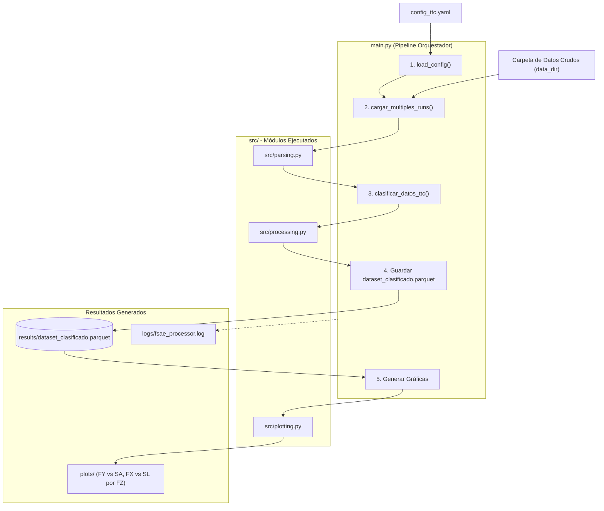

```mermaid
flowchart TD
    Config["config_ttc.yaml"]
    RawData["Carpeta de Datos Crudos (data_dir)"]
    
    subgraph Main ["main.py (Pipeline Orquestador)"]
        LoadConf["1. load_config()"]
        RunParse["2. cargar_multiples_runs()"]
        RunProcess["3. clasificar_datos_ttc()"]
        SaveParquet["4. Guardar dataset_clasificado.parquet"]
        RunPlots["5. Generar Gráficas"]
    end

    subgraph Modules ["src/ - Módulos Ejecutados"]
        Parsing["src/parsing.py"]
        Processing["src/processing.py"]
        Plotting["src/plotting.py"]
    end

    subgraph Outputs ["Resultados Generados"]
        ParquetFile[("results/dataset_clasificado.parquet")]
        PlotFiles["plots/ (FY vs SA, FX vs SL por FZ)"]
        LogFile["logs/fsae_processor.log"]
    end

    Config --> LoadConf
    LoadConf --> RunParse
    RawData --> RunParse
    
    RunParse --> Parsing
    Parsing --> RunProcess
    RunProcess --> Processing
    
    Processing --> SaveParquet
    SaveParquet --> ParquetFile
    
    ParquetFile --> RunPlots
    RunPlots --> Plotting
    Plotting --> PlotFiles

    Main -.-> LogFile
```